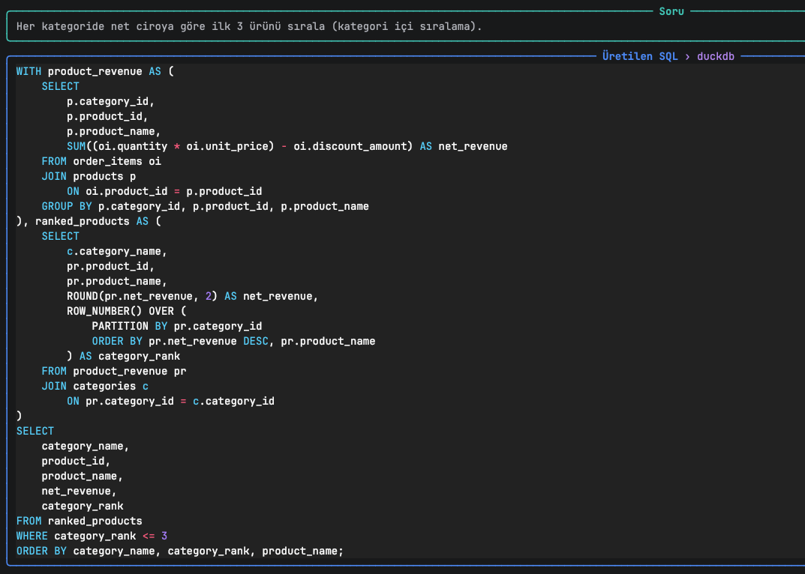
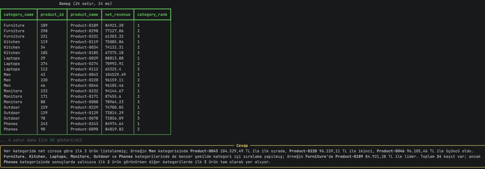
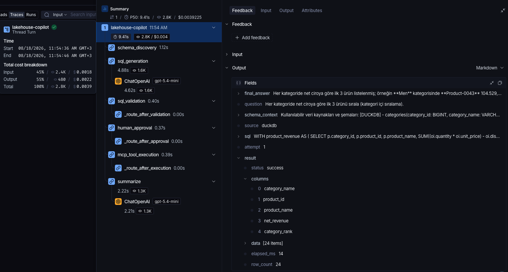

# MCP-Based Autonomous Data Lakehouse Copilot

An autonomous data analytics agent that translates natural-language questions into SQL, executes them against **DuckDB (Parquet)** and **PostgreSQL** through the **Model Context Protocol (MCP)**, self-corrects on failure, and summarizes results in business language.

```
User Question
      │
      ▼
[LangGraph Agent]
      │
      ├─► schema_discovery  (MCP: list_tables + describe_table + semantic layer)
      │
      ├─► sql_generation    (LLM → structured SQL output)
      │
      ├─► sql_validation    (EXPLAIN — catches errors without fetching data)
      │
      ├─► human_approval    (row count estimate → user confirmation if > threshold)
      │
      ├─► mcp_tool_execution (query_sql via MCP)
      │         │
      │    ┌────┴────┐
      │  retry    success
      │    │         │
      ├─► error_analysis   summarize ──► Answer
      │   (LLM fixes SQL,
      │    loops back)
      └─► give_up (max retries exceeded)
```

---

## Features

- **Dual data source:** DuckDB (Parquet files) + PostgreSQL, agent picks the right one per query
- **Self-correction loop:** up to N retries with LLM-powered error analysis
- **SQL dry-run validation:** EXPLAIN before execution — syntax/column errors caught without touching data
- **Human-in-the-loop:** configurable row-count threshold triggers user confirmation before large queries
- **Semantic layer:** auto enum discovery + FK inference injected into schema context
- **Structured outputs:** Pydantic-validated LLM responses — no JSON parse errors
- **SQL guardrails:** only SELECT/WITH allowed; banned keywords, auto LIMIT, path traversal protection
- **LangSmith tracing:** every node, token count, and latency tracked (EU endpoint supported)
- **Eval harness:** 25-question golden set, hybrid exact-match + LLM-judge scoring
- **Per-node timeouts:** anyio cancel scopes prevent runaway queries from blocking the graph

---

## Demo

### Terminal — Question & Answer





### LangSmith — Trace & Cost Breakdown



---

## Quick Start

```bash
python3.11 -m venv .venv && source .venv/bin/activate
pip install -r requirements.txt

cp .env.example .env
# Fill in OPENAI_API_KEY and POSTGRES_URL in .env

python scripts/seed_data.py
python scripts/load_to_postgres.py --drop

python main.py -q "Top 5 categories by revenue in 2024?"
```

---

## Usage

### Single question
```bash
python main.py --question "Ödeme kaydı olmayan siparişleri duruma göre say."
python main.py -q "What are the top 5 products by margin?"
```

### Interactive REPL
```bash
python main.py
soru › 2024'te en çok ciro yapan kategori?
soru › Hiç sipariş vermemiş müşteri sayısı?
soru › exit
```

### Eval harness
```bash
python eval/run_eval.py --mock    # infrastructure test, no LLM calls
python eval/run_eval.py --live    # real LLM, writes eval/report.md
python eval/run_eval.py --live --questions q01,q05,q12
```

### Test MCP servers standalone
```bash
npx @modelcontextprotocol/inspector python -m src.mcp_servers.duckdb_server
npx @modelcontextprotocol/inspector python -m src.mcp_servers.postgres_server
```

---

## Architecture

| Layer | Directory | Responsibility |
|---|---|---|
| Presentation | `main.py` | Rich CLI + REPL + human approval callback |
| Orchestration | `src/agent/` | LangGraph state machine, nodes, prompts, LLM |
| Client | `src/clients/` | Async MCP client (stdio + HTTP transport) |
| Server | `src/mcp_servers/` | FastMCP DuckDB + PostgreSQL servers |
| Semantic | `src/core/semantic_layer.py` | Enum discovery, FK inference |
| Cross-cutting | `src/core/` | Config, logging, guardrails, tracing |
| Eval | `eval/` | Golden set (25 questions), hybrid eval runner |
| Data | `data/processed/` | Parquet files (gitignored) |

**Boundary rule:** agent accesses data only through MCP tools — never via direct `duckdb.connect()`. MCP servers have zero LLM/LangChain imports.

---

## Data Model

7-table e-commerce star schema designed to stress-test the agent:

```
categories ──(self-join: parent_category_id)
    ▲
products ──┐
           │
order_items ──► orders ──► customers
                  ├──► payments  (missing for pending orders → LEFT JOIN test)
                  └──► refunds   (only for refunded orders)
```

| Table | Rows | Key challenge |
|---|---|---|
| `categories` | 13 | Self-join for hierarchy |
| `customers` | 1,000 | ~5% have no orders (anti-join test) |
| `products` | 300 | `cost` column for margin calc |
| `orders` | 5,000 | `shipped_at`/`delivered_at` nullable |
| `order_items` | ~14,000 | `discount_amount` 65% NULL → COALESCE required |
| `payments` | ~4,400 | Missing for `pending` orders |
| `refunds` | ~330 | Sparse, LEFT JOIN required |

---

## Configuration

Key `.env` variables (see `.env.example` for full list):

| Variable | Default | Purpose |
|---|---|---|
| `OPENAI_API_KEY` | — | Required |
| `OPENAI_MODEL` | `gpt-4o` | SQL generation model |
| `POSTGRES_URL` | — | PostgreSQL connection string |
| `DATA_DIR` | `./data/processed` | Parquet files location |
| `MCP_TRANSPORT` | `stdio` | `stdio` or `http` |
| `MAX_RETRIES` | `3` | Self-correction loop limit |
| `MAX_ROWS_RETURNED` | `1000` | Auto-LIMIT value |
| `QUERY_TIMEOUT_SECONDS` | `30` | Per-node MCP timeout |
| `APPROVAL_ROW_THRESHOLD` | `5000` | Human approval trigger (0 = off) |
| `LANGCHAIN_TRACING_V2` | `false` | Enable LangSmith tracing |
| `LANGCHAIN_ENDPOINT` | — | EU: `https://eu.api.smith.langchain.com` |

---

## Quality

```bash
ruff check . && black --check .   # lint + format
mypy src/                          # type check (--strict)
pytest -q                          # unit + integration tests
python eval/run_eval.py --live     # text-to-SQL accuracy (eval/report.md)
```

---

## Observability — LangSmith

Every agent run is traced end-to-end in LangSmith. Each node appears as a separate span with token usage, latency, and metadata.

### Setup

```bash
# .env
LANGCHAIN_TRACING_V2=true
LANGCHAIN_API_KEY=ls-...
LANGCHAIN_PROJECT=lakehouse-copilot

# EU bölgesindeysen:
LANGCHAIN_ENDPOINT=https://eu.api.smith.langchain.com
```

### What you see per run

| Span | Captured |
|---|---|
| `schema_discovery` | Tables fetched, schema context length, source (duckdb/postgres) |
| `sql_generation` | Generated SQL, source choice, rationale, token count |
| `sql_validation` | EXPLAIN result, validation pass/fail |
| `human_approval` | Estimated row count, user decision |
| `mcp_tool_execution` | Executed SQL, row count, elapsed ms, error if any |
| `error_analysis` | Failed SQL, error type, corrected SQL, attempt number |
| `summarize` | Final answer, token count |

### Trace example

```
lakehouse-copilot run  (3.2s total)
  ├── schema_discovery     0.8s   duckdb: 7 tables
  ├── sql_generation       1.1s   → SELECT ... (attempt 1)
  ├── sql_validation       0.1s   ✓ EXPLAIN passed
  ├── human_approval       0.0s   est. 127 rows, below threshold
  ├── mcp_tool_execution   0.4s   ✓ 127 rows / 38ms
  └── summarize            0.8s   → final answer
```

In a retry scenario, the `mcp_tool_execution → error_analysis → mcp_tool_execution` chain appears as separate spans — you can see exactly which SQL failed, why, and how it was corrected.

---

## Security

- Only `SELECT` / `WITH` statements reach the database
- Banned keywords (`DROP`, `DELETE`, `UPDATE`, `INSERT`, `ALTER`, `CREATE`, `ATTACH`, `COPY`, `TRUNCATE`, ...) rejected via word-boundary regex
- Auto `LIMIT` injection prevents OOM from unbounded result sets
- File access confined to `DATA_DIR` (path traversal protection)
- PostgreSQL sessions run with `SET default_transaction_read_only = on`
- API keys never logged or injected into prompts