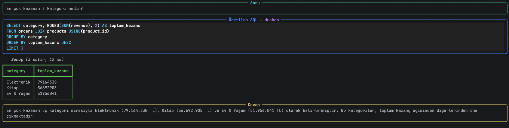
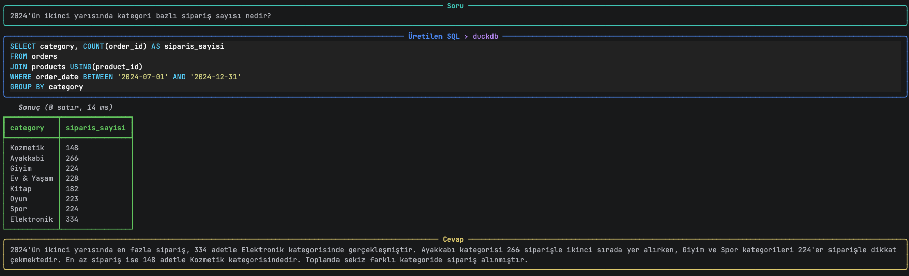
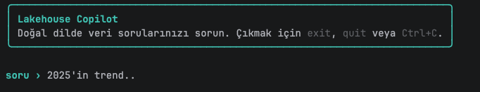
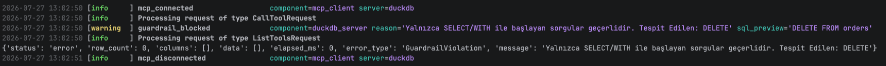

# MCP-Based Autonomous Data Lakehouse Copilot

An autonomous data analytics agent that understands natural-language questions,
accesses **DuckDB (Parquet/CSV)** and **PostgreSQL** data sources through the
**Model Context Protocol (MCP)**, generates and executes SQL, self-corrects on
failure via a **LangGraph state machine**, and summarizes results in business
language.

```
User Question
      │
      ▼
[LangGraph Agent] ──► schema_discovery ──► sql_generation
      ▲                                          │
      │                                          ▼
      └────── error_analysis ◄── validate ── mcp_tool_execution
                  (max N retries)                │
                                                 ▼
                                            summarize ──► Answer
```


---

## Installation

Requirements: **Python 3.11+**, Node.js (only for MCP Inspector, optional).

```bash
# 1. Virtual environment
python3.11 -m venv .venv
source .venv/bin/activate

# 2. Dependencies
pip install -r requirements.txt

# 3. Environment variables
cp .env.example .env
# Edit .env — at minimum fill in OPENAI_API_KEY

# 4. Seed data (Parquet: customers, products, orders)
python -m scripts.seed_data
```

For PostgreSQL support (optional): install PostgreSQL locally, create the
`lakehouse` database with a read-only role, update `POSTGRES_URL` in `.env`, and
run `python -m scripts.seed_postgres`.

---

## Running

### CLI — single question
```bash
python main.py --question "What are the top 3 categories by revenue?"
```

### CLI — interactive REPL
```bash
python main.py
soru › How many customers are in Istanbul?
soru › What are the top 5 most expensive products?
soru › exit
```

### Testing the MCP server standalone (Inspector)
```bash
npx @modelcontextprotocol/inspector python -m src.mcp_servers.duckdb_server
```
Opens a browser panel where you can invoke tools manually.

---

## Architecture — Layers

| Layer | Directory | Responsibility |
|---|---|---|
| Presentation | `main.py` | Rich-powered CLI + REPL |
| Orchestration | `src/agent/` | LangGraph state machine + nodes + prompts |
| Client | `src/clients/` | Async MCP stdio client |
| Server | `src/mcp_servers/` | FastMCP DuckDB + PostgreSQL servers (no LLM knowledge) |
| Cross-cutting | `src/core/` | Config, logging, exceptions, guardrails |
| Data | `data/processed/` | Parquet files (gitignored) |

**Critical boundary rule:** the agent must not call `duckdb.connect()`
directly — data is accessible only through MCP tools. MCP servers do not import
LLM/LangChain code.

---

## Security — SQL Guardrail

Defense-in-depth: application-layer parser + database-level enforcement.

- Only `SELECT` / `WITH ... SELECT` statements are allowed.
- Banned keywords (`DROP`, `DELETE`, `UPDATE`, `INSERT`, `ALTER`, `CREATE`,
  `ATTACH`, `COPY`, `INSTALL`, `LOAD`, `TRUNCATE`, `GRANT`, `REVOKE`, `VACUUM`,
  `SET`) are rejected via word-boundary regex (so `updated_at` ≠ `update`).
- Automatic `LIMIT` (default 1000) is injected when missing.
- File access is confined to `DATA_DIR` (path traversal protection).
- Banned keywords inside string literals do not trigger false positives.
- PostgreSQL sessions are pinned to `SET default_transaction_read_only = on`
  and use a dedicated read-only role (`analytics_ro`).

---

## Quality

```bash
ruff format . && ruff check .    # style + lint
mypy                              # type check (--strict)
pytest --cov=src                  # tests + coverage
```

Current status: **66/66 tests passing, ~93% coverage, ruff clean, mypy --strict clean.**

---

## Configuration (`.env`)

See `.env.example` for the full list and defaults. Highlights:

| Variable | Purpose |
|---|---|
| `OPENAI_API_KEY` | Required for GPT-4o calls |
| `OPENAI_MODEL` | Default `gpt-4o`, alternative: `gpt-4o-mini` |
| `POSTGRES_URL` | PostgreSQL connection string (optional) |
| `MAX_RETRIES` | Self-correction loop upper bound (default 3) |
| `MAX_ROWS_RETURNED` | Auto-LIMIT value (default 1000) |
| `LOG_LEVEL` | `DEBUG` / `INFO` / `WARNING` / `ERROR` |
| `DATA_DIR` | Location of Parquet files (default `./data/processed`) |

---

## Screenshots

### 1. Simple aggregation — DuckDB source
```bash
python main.py --question "En çok kazanan 3 kategori nedir?"
```


The agent selects DuckDB, produces JOIN + GROUP BY, and summarizes in business
Turkish.

### 2. Complex query + time filter
```bash
python main.py --question "2024'ün ikinci yarısında kategori bazlı sipariş sayısı nedir?"
```


Combines WHERE + GROUP BY with date filtering.

### 3. Interactive REPL
```bash
python main.py
```


Ask multiple questions back-to-back; exit with `exit` / `quit` / `Ctrl+C`.

### 4. Guardrail block (developer test)
```bash
python -c "
import asyncio
from src.clients.mcp_client import duckdb_client

async def main():
    async with duckdb_client() as c:
        r = await c.call_tool('query_sql', {'sql': 'DELETE FROM orders'})
        print(r)

asyncio.run(main())
"
```


Attempting a `DELETE` returns a `GuardrailViolation`; the process does not
crash — it returns a structured error envelope.

---

## Example Questions

Verified against the seeded dataset:

- *"What are the top 3 categories by revenue?"*
- *"How many customers are in Istanbul?"*
- *"For each customer, show total orders and signup date — first 5."*
- *"Total spend by KOBİ segment customers?"*
- *"Categories of the top 10 most expensive products?"*
- *"Customers from PostgreSQL who live in Ankara?"*
- *"Top 5 best-selling products from Parquet?"*

---

## Log Stream

When the CLI runs:
- **Console:** Rich-formatted output (Question, SQL, Result table, Answer panel)
- **stderr:** structlog INFO lines (to trace the agent flow)
- **`logs/copilot.log`:** JSON lines (for `grep` / `jq` / log aggregators)

For a quieter console: `python main.py 2>/dev/null` (logs still write to file).
